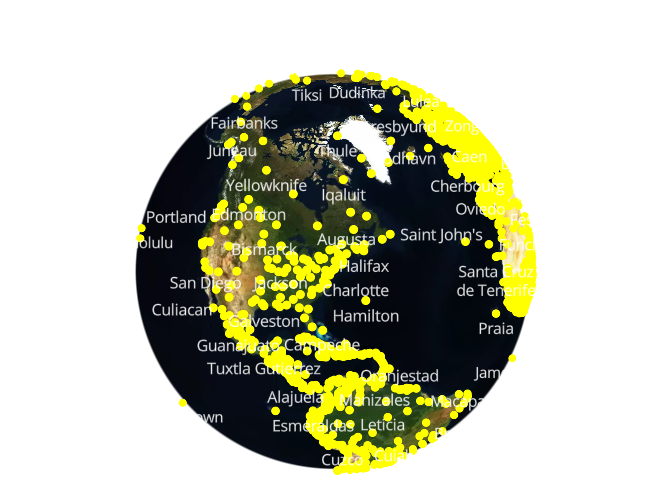
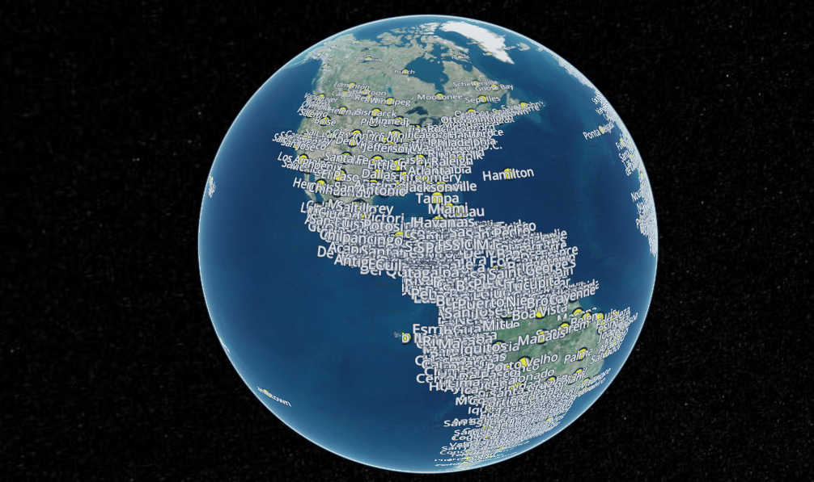

# MVT-Tiler

Simply Builds mapbox vector tilesets from of GeoJSON(for now supports only point).




[](http://www.youtube.com/watch?v=goE5BPXzzBQ)

## To generate MVT tileset from sample points data.

```
yarn gen-mvt-tileset
```

## To test generated mvt tiles

1 start MVT tile server.

```
yarn mvt-server
```

2 execute client/mapbox.html, client/cesium.html on your web server.

## Reference

https://keita.blog/2022/04/16/creating-vector-tiles-from-scratch-using-typescript/
